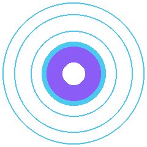
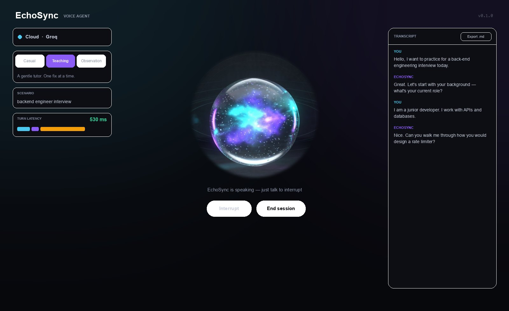
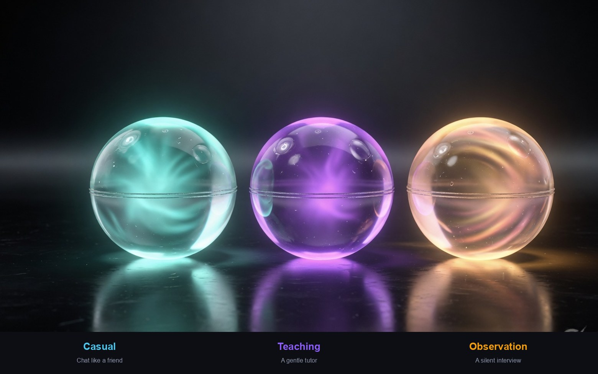
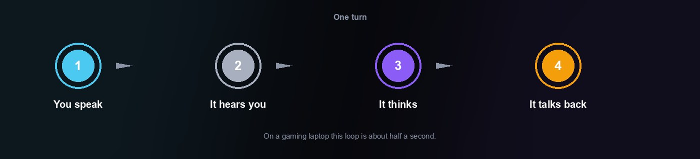
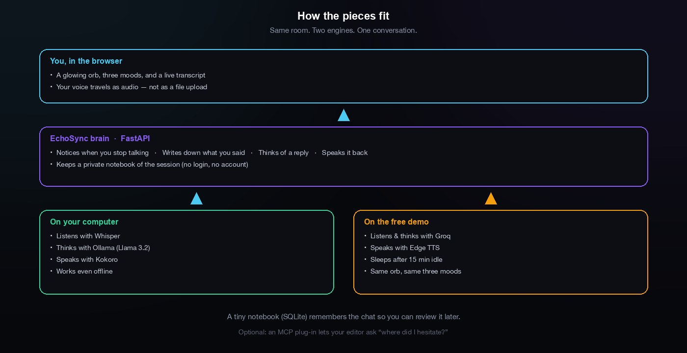
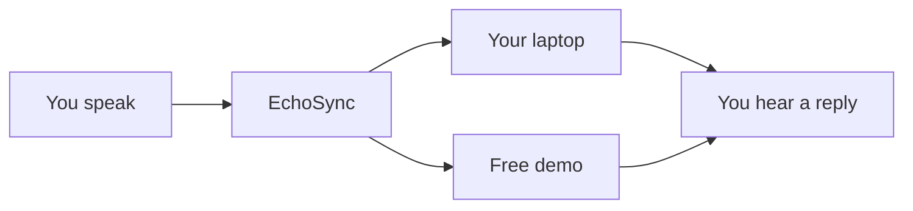
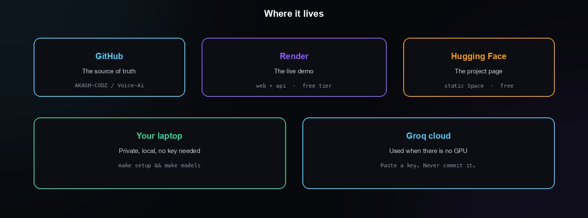

<p align="center">
  
</p>

<h1 align="center">EchoSync AI</h1>

<p align="center">
  
</p>

<p align="center">
  You want to speak English more confidently.<br/>
  A practice partner is not always around.<br/>
  EchoSync sits with you, listens, and talks back.
</p>

<p align="center">
  <a href="https://echosync-web.onrender.com"></a>
  &nbsp;
  <a href="#run-it-on-your-computer"></a>
</p>

<p align="center">
  
</p>

<p align="center">
  
</p>

---

## The room

<p align="center">
  
</p>

Pick a mood. Press start. Speak. It answers. A transcript writes itself on the side.

---

## Three moods

<p align="center">
  
</p>

| Casual | Teaching | Observation |
| --- | --- | --- |
| Chat like a friend. Mistakes are fixed with a question, never a scolding. | A gentle tutor. One fix at a time. If you freeze, it offers a hint. | A mock interview. No praise, no correction. Review the notes after. |

---

## How a turn feels

<p align="center">
  
</p>

You stop talking → it replies.

About **half a second** on a gaming laptop. About **one second** on a Mac.

---

## Architecture

<p align="center">
  
</p>

Same orb. Two engines. Your computer if it can. The cloud if it cannot.



---

## Tools

| Job | Tool |
| --- | --- |
| The screen | Next.js |
| The brain | FastAPI |
| Hears you | Whisper on your machine, or Groq on the demo |
| Thinks | Ollama (Llama 3.2) on your machine, or Groq on the demo |
| Speaks | Kokoro on your machine, or Edge TTS on the demo |
| Notices a pause | Silero |
| Remembers the chat | SQLite |
| Optional review in your editor | MCP |

<p align="center">
  
  
  
  
  
  
</p>

---

## Where it lives

<p align="center">
  
</p>

| Place | What it is |
| --- | --- |
| [Try it live](https://echosync-web.onrender.com) | Free Render demo. Sleeps after 15 minutes of quiet. First open can take a minute. |
| [Hugging Face page](https://huggingface.co/spaces/Akash-8/EchoSync-AI) | Project page. No microphone on the free plan. |
| Your laptop | Private. No account. No key needed if Ollama is installed. |

One clone, one computer. There is nothing to wire together.

---

## Academic note

**Problem.** Spoken English needs a partner. Partners are scarce. Interviews are hard.

**Method.** A live voice loop: notice the end of a sentence, write it down, think of a reply, speak it. Three teaching styles. Runs on your machine when it can, and on a free cloud demo when it cannot.

**Result.** About **530 ms** to first sound on an RTX 5070 laptop. **93** automated tests. A public demo on Render.

---

## Try it live

**https://echosync-web.onrender.com**

Allow the microphone. Wait through the first wake-up if the demo was sleeping.

[](https://render.com/deploy?repo=https://github.com/AKASH-CODZ/Voice-Ai)

Paste `GROQ_API_KEY` when asked. Do not commit it.

---

## Run it on your computer

```bash
git clone https://github.com/AKASH-CODZ/Voice-Ai.git
cd Voice-Ai
cp .env.example .env
make setup && make models
make backend          # :8000
make frontend         # :3000
```

Use **Python 3.11 or 3.12**.

If Ollama is installed, pull the chat model once:

```bash
ollama pull llama3.2:3b-instruct-q4_K_M
```

No GPU? Add a Groq key to `.env` and the cloud path takes over.

<details>
<summary><strong>Docker, tests, and extra notes</strong></summary>

```bash
make up-cloud         # cloud path in Docker
make up-gpu           # CUDA host
make test             # pytest
make lint             # ruff + tsc
make bench            # five real turns on this machine
```

MCP (read-only session notes in your editor):

```bash
claude mcp add echosync -- python -m echosync_mcp.server
```

Design choices: [`docs/decisions.md`](docs/decisions.md).
</details>
